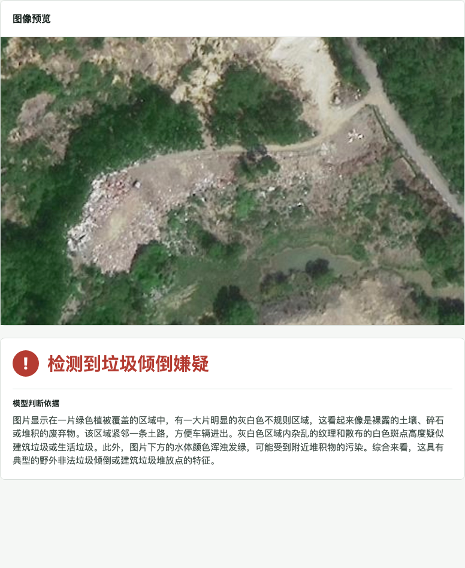
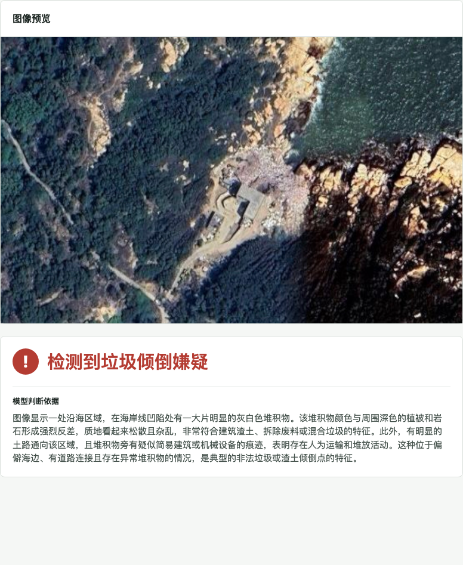
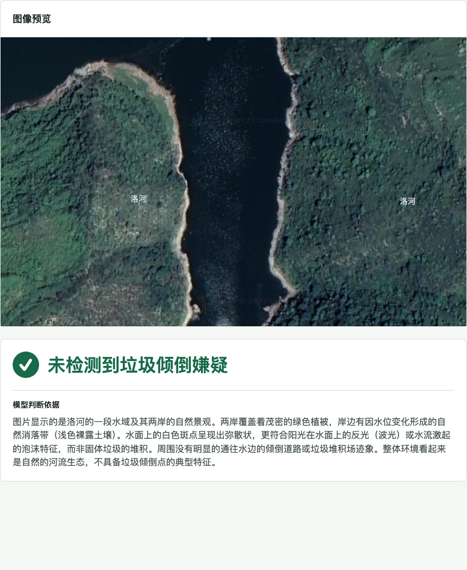

# 我把“卫星巡查垃圾倾倒”做成了一个开源小工具：上传一张图，AI 先帮你筛一遍

如果你在地图上看到一块奇怪的裸地，旁边有一条小路，周围又没有居民区，你会怎么判断它是不是垃圾倾倒点？

过去，这类线索通常要靠人工一张张看图。问题是，遥感图像太多了，人眼很容易疲劳；而真正值得复核的地点，往往藏在道路尽头、林地边缘、荒地角落这些不起眼的位置。

所以我做了一个小工具：**上传一张遥感或航拍图片，让多模态模型先判断是否存在疑似垃圾倾倒风险。**

项目已经开源：

https://github.com/CosmosShadow/satellite-waste-detector

## 它能做什么？

这个工具不抓地图、不读坐标，也不需要你把 API Key 写进代码。

打开本地网页之后，只需要三步：

1. 填入自己的多模态模型 API Key。
2. 选择模型，比如默认的 `qwen3.6-plus`。
3. 上传一张遥感图片，点击开始研判。

模型会输出两个核心信息：

- 是否检测到垃圾倾倒嫌疑
- 为什么这么判断

它不是执法结论，也不能替代现场核查。但它可以做一件很实用的事：**把大量图片先筛一遍，把最可疑的点挑出来。**

## 看几张实际效果

下面这些截图都是在本地浏览器里真实跑出来的结果。

### 例子一：道路旁的异常裸露区域

这张图里，模型关注到的是道路可达、区域周边没有成片建筑，以及裸露区域内部纹理比较杂乱。它给出的结论是：检测到垃圾倾倒嫌疑。

这种场景很典型。单看图片，人会先看到“裸地”；但模型会进一步结合道路、周边建筑、区域形态来判断。

### 例子二：靠近海岸线的可疑堆积区

这类区域更难看，因为它靠近自然地貌，容易和岩石、裸地混在一起。模型给出的理由是：道路可以到达，周边缺少居民区，同时存在疑似人为堆积和异常裸露。

### 例子三：没有明显道路条件的区域

这张图模型判定为未检测到明显倾倒特征。它的主要依据是：缺少可供车辆通行的道路条件，也没有看到典型的异常堆积区域。

## 准确率怎么样？

我用仓库里自带的 36 张 JPEG 样本做了一轮测试：

- 模型：`qwen3.6-plus`
- 正确识别：31/36
- 准确率：86.11%
- 垃圾样本漏报：2 张
- 非垃圾样本误报：3 张

这个数字不能被理解成“任何地方都能达到 86%”。遥感图像的分辨率、拍摄时间、遮挡、施工裸地、农田、自然裸地都会影响结果。

但它说明了一件事：**多模态模型已经可以在这类低成本筛查任务里提供相当有用的第一轮判断。**

## 为什么不直接让模型说“有垃圾/没垃圾”？

因为这样太粗糙。

垃圾倾倒点不是一个单纯的视觉分类问题。很多误判都来自这些情况：

- 道路尽头的普通裸地
- 正常施工区域
- 农田、采石区、自然岩石
- 距离候选区域很远的零散建筑

所以这个工具的提示词会要求模型围绕候选区域做判断：先看道路可达性，再看周边建筑，再看异常扰动，最后排除施工、农田和自然裸地。

简单说，它不是只问“这像不像垃圾”，而是问：

**这个地方是否符合偷倒垃圾的空间逻辑？**

## 适合谁用？

这个工具更适合这些场景：

- 环保、城管、园区巡查前的线索筛选
- 遥感图像中的异常点初筛
- 多模态模型在真实业务里的小型验证
- 教学或演示：让大家直观看到视觉模型如何分析遥感图

它不适合直接做自动执法，也不应该绕过人工复核。正确用法是：**AI 先筛，人工再看，现场最后确认。**

## 开源地址

代码、样例图片、README 和本地运行方法都在这里：

https://github.com/CosmosShadow/satellite-waste-detector

本地启动后，浏览器打开：

http://127.0.0.1:8111

填入自己的 API Key，就可以跑。

## 最后

过去我们说“卫星巡查”，很容易想到昂贵系统、复杂平台和长周期项目。

但现在，一个 Python 后端、一个网页、一个多模态模型，就已经可以做出一个能跑、能看、能开源的小工具。

它还不完美，但方向很清楚：

**以后不是人盯着每一张图，而是 AI 先把最值得看的地方推到人面前。**
